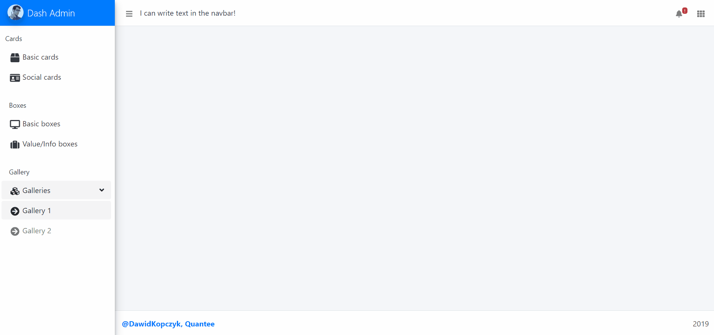
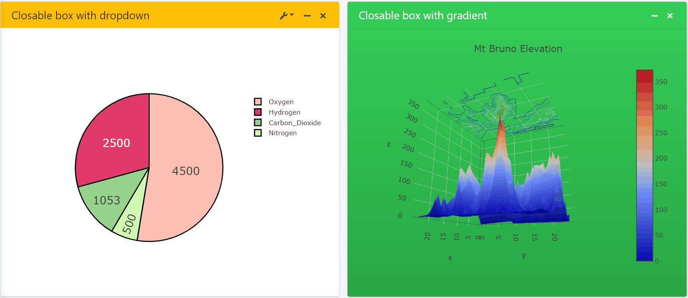
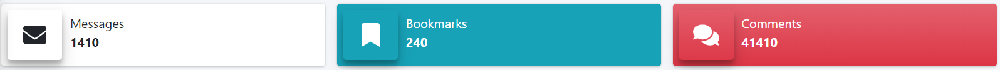
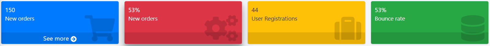
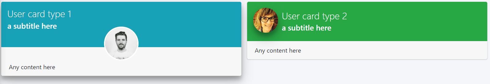

# dash-admin-components

Creating a fully resposive, beautiful dashboard with [Plotly Dash][dash-homepage] has never been easier! 

*dash-admin-components* relies on [shinydashboard implementation][admin-homepage] of AdminLTE3 template. 

It comes with preloaded Bootstrap 4 stylesheet that is fully compatibile with [dash-bootstrap-components][dash-bootstrap-homepage]. 

## Installation

### PyPI

You can install *dash-admin-components* with `pip`:

```
pip install dash-admin-components
```

## Example

You can analyze the example [here][dac-example] and code behind the example [here][dac-example-repo].

## Components

*dash-admin-components* includes several high-level components
and can be composed with other components from
[dash-core-components][dash-core-homepage] and
[dash-bootstrap-components][dash-bootstrap-homepage].

### Dynamic Page with Sidebar, Navbar, Controlbar, Body and Footer.



---

### Collapsible and Closeable Boxes



---

### InfoBoxes



---

### ValueBoxes



---

### UserBoxes



For a full list of components, head over to [example code][dac-example-repo].

## Contributing
This project was generated by the [dash-component-boilerplate](https://github.com/plotly/dash-component-boilerplate) it contains the minimal set of code required to create your own custom Dash component.

[dash-homepage]: https://dash.plot.ly/
[admin-homepage]: https://github.com/RinteRface/bs4Dash
[dash-core-homepage]: https://dash.plot.ly/dash-core-components
[dash-bootstrap-homepage]: https://dash-bootstrap-components.opensource.faculty.ai
[dac-example-repo]: /example
[dac-example]: http://dash-admin-components.opensource.quantee.ai/